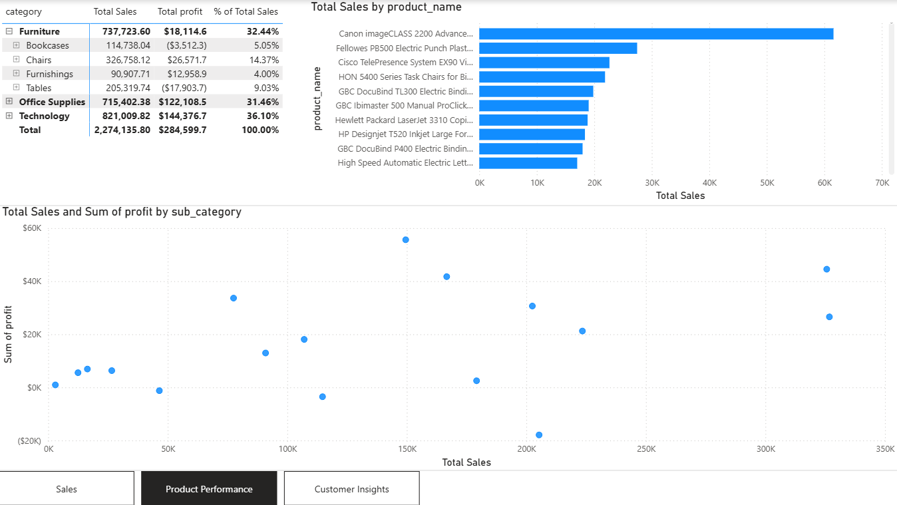

# 📊 End-to-End BI Pipeline Simulation (Innowise Task)

## Project Overview
This repository contains a complete Business Intelligence pipeline simulation, starting from Data Ingestion (ETL) and Data Modeling to advanced Data Visualization in Power BI. The project uses the Superstore dataset to simulate real-world data engineering and analytical scenarios.

## echnology Stack
* **Database:** PostgreSQL (Dockerized)
* **Scripting:** Python (Pandas)
* **BI Tool:** Power BI Desktop
* **Languages:** SQL, DAX

## Step 1: Data Engineering & ETL Pipeline
The data architecture is divided into three physical layers to ensure data quality and performance:
1. **Stage Layer:** Raw data ingestion.
2. **Core Layer (3NF):** Normalized tables (`orders`, `customers`, `products`, `order_details`).
3. **Mart Layer (Star Schema):** Denormalized tables optimized for reporting.

### Incremental Load Simulation
A Python script was used to split the dataset into `initial_load` (80%) and `secondary_load` (20%). The ETL SQL scripts handle complex scenarios during the secondary load:
* **Skipping Duplicates:** Ensures existing transactions are not duplicated in the `fact_sales` table.
* **SCD Type 1:** In-place updates for minor changes (e.g., Customer Name corrections).
* **SCD Type 2:** Historical tracking for major dimension changes (e.g., Customer Segment/Region changes), utilizing `valid_from`, `valid_to`, and `is_current` flags.

## Step 2: Power BI Development
The Power BI report connects directly to the Mart layer.

### Key Features Implemented:
* **Robust Data Model:** Star schema with 1-to-Many relationships and a custom DAX `DimDate` table.
* **Advanced DAX:** Extensive use of time-intelligence (`YTD`, `SAMEPERIODLASTYEAR`), context manipulation (`REMOVEFILTERS`), and aggregations (`SUM` vs `SUMX`).
* **Interactive Storytelling:** 3 cohesive dashboard pages (Sales Overview, Product Performance, Customer Insights) with intuitive Bookmarks and Page Navigation buttons.
* **Data Security (RLS):** Implemented Row-Level Security restricting access based on the `Region` dimension (e.g., West Region Manager view).
